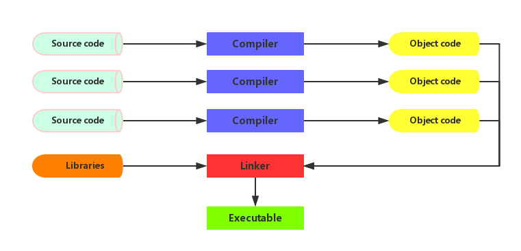

###C的编译和执行

#####大体过程

&nbsp;&nbsp;&nbsp;&nbsp;从这个图中我们可以看到一个大体的流程，源文件通过编译器的编译编程目标文件，目标文件和库文件被链接器链接起来，成为一个可执行文件。
&nbsp;&nbsp;&nbsp;&nbsp;这里只是比较简单的叙述，下面我们要讲述里面的一点细节，看看各个过程究竟干了什么。
&nbsp;&nbsp;&nbsp;&nbsp;我们分下面几个阶段进行叙述：
* 编译：预编译处理/优化器/汇编器
* 链接：连接器

#####预编译处理
&nbsp;&nbsp;&nbsp;&nbsp;预处理器的输入是一个程序，对于里面的指令，处理器会进行识别，接着处理，最后进行删除，所以预处理的输出是一个不包含指令的程序，然后经过编译器的检查，最后翻译成目标文件。
&nbsp;&nbsp;&nbsp;&nbsp;在预处理的时候有四种指令类型需要处理：
* 宏定义指令
* 条件编译指令
* 头文件包含指令
* 其他

&nbsp;&nbsp;&nbsp;&nbsp;具体的例子看ready_compile.c

#####优化器
&nbsp;&nbsp;&nbsp;&nbsp;优化器的主要功能是对预处理后的程序进行优化

#####汇编器
&nbsp;&nbsp;&nbsp;&nbsp;汇编器将代码目标文件，这个时候代码已经是二进制文件了，目标文件一般具有以下两个段：
* 代码段：该段中所包含的主要是程序的指令
* 数据端：包含全局变量和静态数据等

#####链接器
&nbsp;&nbsp;&nbsp;&nbsp;目标程序已经是机器码了，为什么还要链接器的存在。我们发现在程序中有很多include包含文件，这个时候就需要链接器去将文件链接起来，然后才可执行。
&nbsp;&nbsp;&nbsp;&nbsp;静态库的链接在编译时会被编译进汇编文件，这样的操作会改变文件大小；而动态库则是在执行时（双击运行），当需要动态库中的文件时才被链接到可执行文件的。